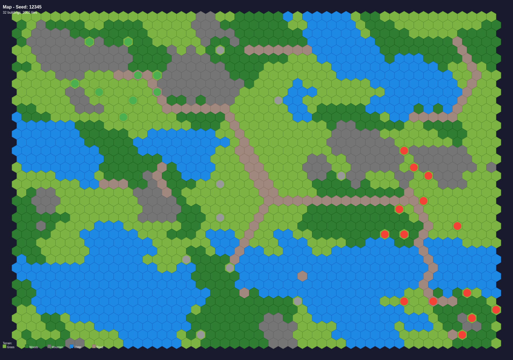
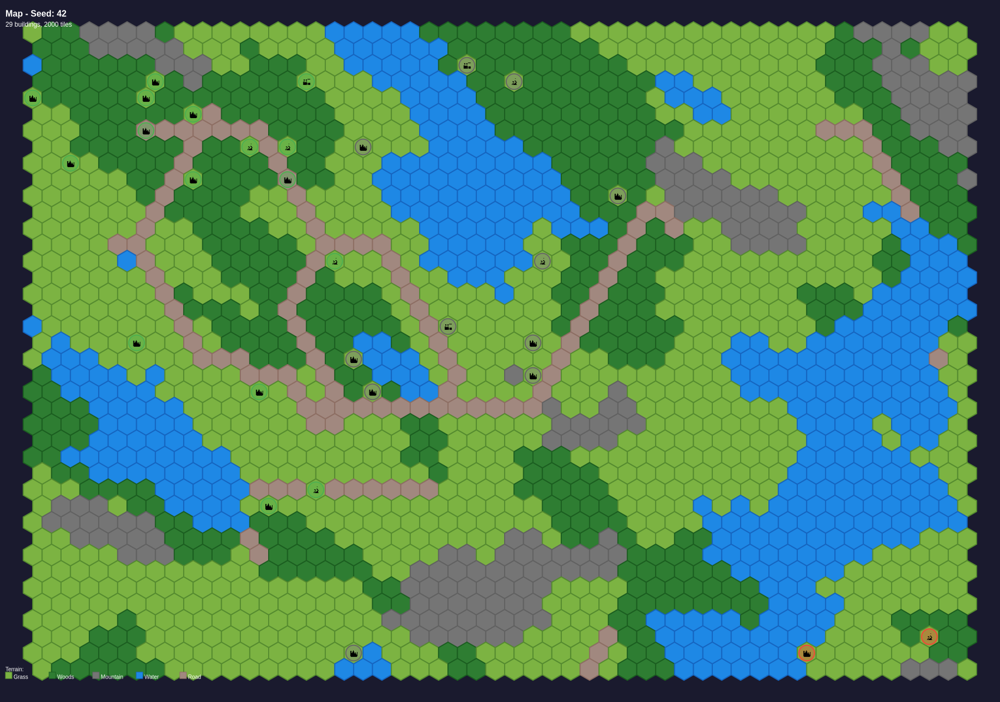
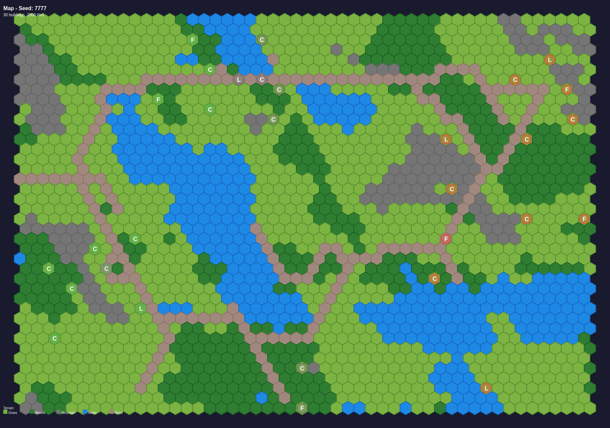
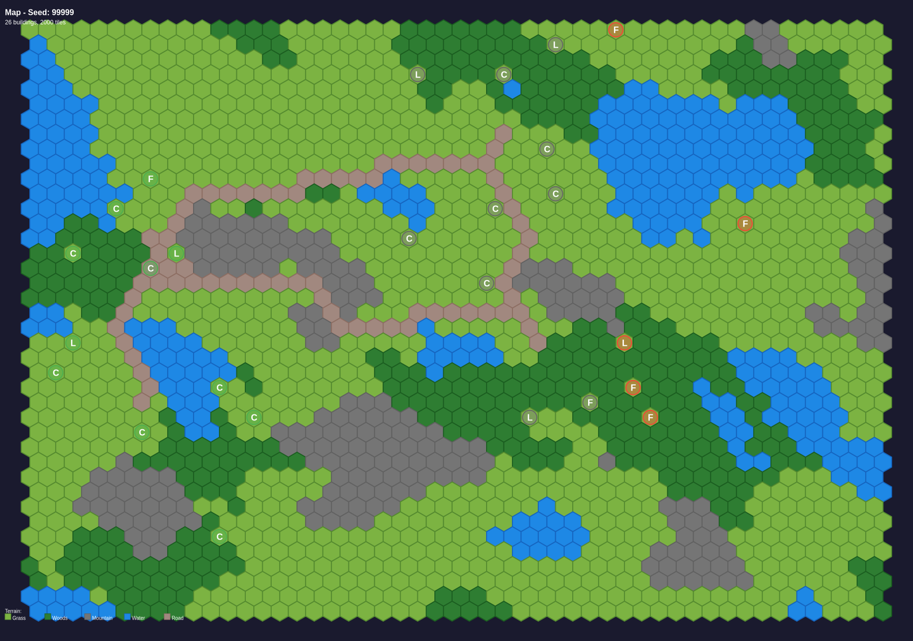

# Pull Request Details

## PR URL
https://github.com/eschluntz/hex-wars/pull/new/claude/map-generation-overhaul-YZhEF

## Title
Overhaul map generation: building clusters and pathfinding-based roads

## Body

## Summary

This PR completely redesigns the building and road generation system for the game, implementing a cluster-based approach with intelligent pathfinding for roads.

### Building Generation Changes

**Building Clusters (N=4):**
- Generate 4 building clusters across the map
- Each cluster contains 4-8 buildings
- First building in each cluster is always a **lab** 🔬
- Remaining buildings are **cities** 🏙️ (70%) and **factories** 🏭 (30%)
- Buildings are placed within a radius of 5 tiles from cluster center
- Minimum spacing of 2 tiles enforced within clusters

**Singleton Buildings (M=8):**
- 8 random standalone buildings scattered across the map
- Distribution: 50% cities, 30% factories, 20% labs
- Minimum spacing of 3 tiles from cluster buildings

**Building Placement Rules:**
- Buildings only place on valid terrain: grass, woods, or existing roads
- Cannot place on water or mountains
- Ownership assigned based on horizontal position (left=player, right=enemy, middle=neutral)

### Road Generation Changes

**Pathfinding-Based Roads:**
- Each cluster connects to its 2 nearest neighbors using **A* pathfinding**
- Roads follow the terrain, creating organic networks
- Custom terrain costs for pathfinding:
  - Grass: 1
  - Woods: 1.5
  - Mountain: 3
  - Water: 4
  - Existing road: 0.3 (encourages road reuse)

This creates much more natural-looking road networks that avoid obstacles and prefer easier terrain.

### Map Rendering

Added a new rendering script (`scripts/render-maps.ts`) that:
- Uses node-canvas to render maps to PNG images
- Generates multiple map variations with different seeds
- Includes legend and metadata
- Run with: `npm run render-maps`

## Sample Generated Maps

Below are sample maps generated with different seeds to demonstrate the new generation system:

### Map with Seed 12345

### Map with Seed 42

### Map with Seed 7777

### Map with Seed 99999

## Test Plan

- [x] Maps generate successfully with new cluster system
- [x] Building counts are correct (16-32 cluster buildings + 8 singletons = 24-40 total)
- [x] Roads connect clusters using pathfinding
- [x] Buildings only place on valid terrain
- [x] Map rendering script generates PNG images
- [x] Code compiles without errors

## Technical Details

**Files Changed:**
- `src/game-map.ts`: Complete rewrite of `generateBuildings()` and roads generation
- `scripts/render-maps.ts`: New script for rendering maps to images
- `package.json`: Added `render-maps` script and canvas dependencies

**New Dependencies:**
- `canvas`: For Node.js canvas rendering
- `@types/node`: TypeScript types for Node.js

---

## How to Create the PR

Since automated PR creation is not available in this environment, please:

1. Visit the PR URL above, or
2. Go to https://github.com/eschluntz/hex-wars/pulls and click "New Pull Request"
3. Select `claude/map-generation-overhaul-YZhEF` as the compare branch
4. Copy the title and body content from this file
5. The map images are already committed and will be visible in the PR

## Generated Map Images

The following map images have been generated and committed to the repository:
- map-renders/map-seed-12345.png
- map-renders/map-seed-42.png
- map-renders/map-seed-7777.png
- map-renders/map-seed-99999.png

These will be automatically displayed in the PR when you use the body content above.
